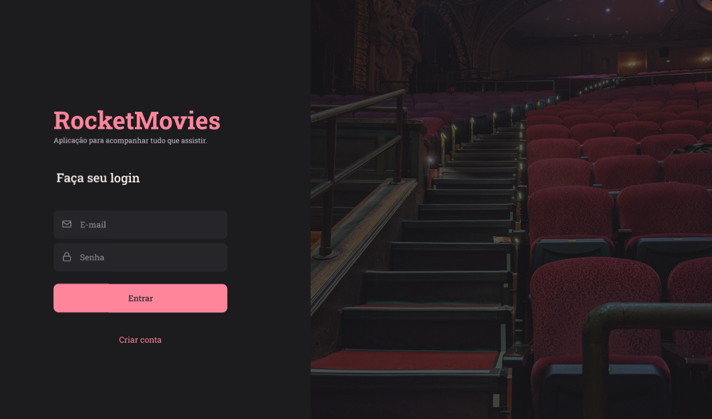

# Rocket-movies

 

Página web criada em React a partir de layout no figma.
Desafio do NLW da  da Rockeseat. 

Figma [https://www.figma.com/file/0OuLNi7z83yeoeUdohXcfs/DoctorCare-(Community)?node-id=0%3A1](https://www.figma.com/file/9l1dKIqATQRP3os0L7xtYb/RocketMovies-(Copy))

## 🚀 Começando - 

Rocketmovies é o front-end de uma aplicação que possui back-end em node.js e será responsavel por salvar os filmes favoritos dos usuários e suas respectivas notas.

### 📋 Pré-requisitos

### 🔧 Instalação

## 📦 Desenvolvimento

É uma página em react que renderiza os componentes em HTML e CSS

## 🛠️ Construído com

REACT, HTML, CSS

## 📌 Versão

Versão única

## ✒️ Autores

 * **Explorer Rocketseat**

* **Paulo Victor Pinheiro** - *Trabalho Inicial* - [Paru - Paulo Victor](https://www.linkedin.com/in/paulo-pinheiro-4a94b0150/)

## 🎁 Agradecimentos

* Gratidão à equipe Rocketseat

---
⌨️ com ❤️ por [Paulo Victor](https://gist.github.com/Paru369) 😊
